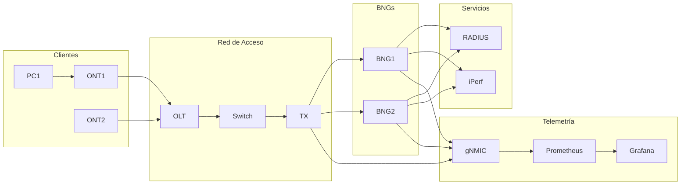

# Nokia BNG Lab - Red Neutral con Containerlab

<div class="grid cards" markdown>

-   :material-network:{ .lg .middle } __Red Neutral Multi-BNG__

    ---

    Laboratorio diseñado como infraestructura de red neutral que permite agregar múltiples BNGs para diferentes operadores

-   :material-server:{ .lg .middle } __Nokia SROS + SR Linux__

    ---

    Integración completa de equipos Nokia 7750 SR, 7250 IXR y SR Linux en un único laboratorio

-   :material-chart-line:{ .lg .middle } __Stack de Telemetría__

    ---

    Monitoreo en tiempo real con gNMIC, Prometheus y Grafana

-   :material-shield-account:{ .lg .middle } __Autenticación RADIUS__

    ---

    Autenticación de suscriptores con FreeRADIUS y atributos Nokia VSA

</div>

## Descripción General

Este laboratorio implementa una **red neutral de acceso** utilizando **Containerlab** como plataforma de virtualización. La arquitectura está diseñada para simular un escenario real de proveedor de servicios donde múltiples operadores pueden conectar sus propios BNGs (Broadband Network Gateways) a una infraestructura de acceso compartida.

### Componentes Principales

| Componente | Modelo/Imagen | Función |
|------------|---------------|---------|
| **BNG1** | Nokia 7750 SR-7 (SRSIM) | Gateway de banda ancha ISP1 |
| **BNG2** | Nokia 7750 SR-7 (SRSIM) | Gateway de banda ancha ISP2 |
| **TX** | Nokia SR Linux | Switch de transporte |
| **Switch** | Nokia 7250 IXR-ec (SRSIM) | Switch de agregación |
| **OLT** | Nokia 7250 IXR-ec (SRSIM) | Terminal de línea óptica |
| **ONT1/ONT2** | Contenedor Linux | Terminales de red óptica |
| **RADIUS** | FreeRADIUS | Servidor de autenticación |
| **gNMIC** | OpenConfig gNMIC | Colector de telemetría |
| **Prometheus** | Prometheus | Base de datos de métricas |
| **Grafana** | Grafana | Visualización de métricas |

### Características Técnicas

!!! info "Tecnologías Implementadas"
    
    - **ESM (Enhanced Subscriber Management)**: Gestión avanzada de suscriptores en Nokia SROS
    - **Dual-Stack IPv4/IPv6**: Soporte completo para DHCPv4, DHCPv6 y Prefix Delegation
    - **CGNAT (Carrier-Grade NAT)**: NAT a gran escala con pools de direcciones
    - **IPoE y PPPoE**: Soporte para ambos protocolos de sesión
    - **VPLS/Q-in-Q**: Servicios de capa 2 con encapsulación QinQ
    - **gNMI Telemetry**: Streaming de telemetría en tiempo real

### Diagrama de Alto Nivel



### Flujo de Tráfico

1. **ONT → OLT**: El tráfico de cliente sale de la ONT con VLAN 150
2. **OLT → Switch**: El OLT encapsula con S-VLAN (50 para BNG1, 60 para BNG2)
3. **Switch → TX**: Transporte transparente de QinQ
4. **TX → BNG**: Conmutación por MAC-VRF hacia el BNG correspondiente
5. **BNG**: Capture-SAP intercepta el tráfico y crea sesión de suscriptor

### Acceso al Laboratorio

Una vez desplegado el laboratorio, los servicios están disponibles en:

| Servicio | URL/Puerto | Credenciales |
|----------|------------|--------------|
| Grafana | `http://localhost:3030` | admin/admin |
| Prometheus | `http://localhost:9090` | N/A |
| BNG1 SSH | `ssh -p 56661 admin@localhost` | admin/lab123 |
| BNG2 SSH | `ssh -p 56664 admin@localhost` | admin/lab123 |
| Switch SSH | `ssh -p 56667 admin@localhost` | admin/lab123 |
| OLT SSH | `ssh -p 56678 admin@localhost` | admin/lab123 |
| TX (SR Linux) | `ssh -p 56676 admin@localhost` | admin/lab123 |

## Inicio Rápido

```bash
# Clonar el repositorio
git clone https://github.com/abelperezr/nokia-bng-lab.git
cd nokia-bng-lab

# Desplegar el laboratorio
sudo containerlab deploy -t lab.yml

# Verificar estado de los nodos
sudo containerlab inspect -t lab.yml

# Acceder a Grafana
firefox http://localhost:3030
```

!!! warning "Requisitos Previos"
    
    - Docker instalado y funcionando
    - Containerlab v0.50+ instalado
    - Imágenes Nokia SRSIM disponibles localmente
    - Al menos 32GB de RAM recomendados
    - Licencia Nokia válida para SRSIM
