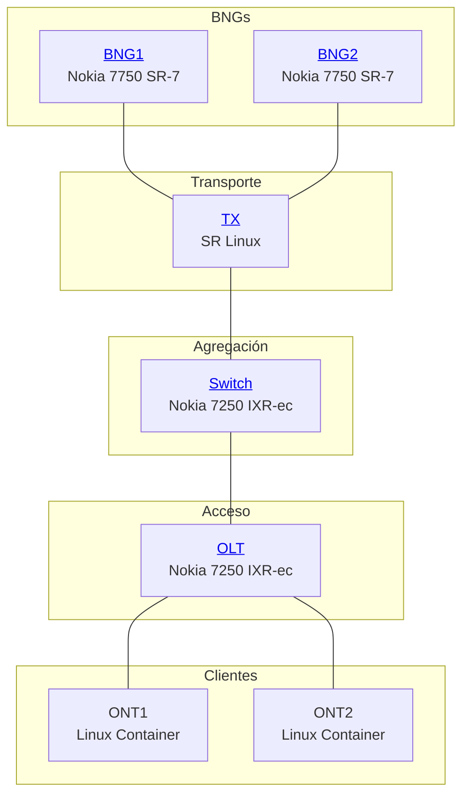

# MOPT de Dispositivos

## Método de Operación y Procedimientos Técnicos

Esta sección documenta las configuraciones detalladas de cada dispositivo en el laboratorio. Cada configuración está organizada por secciones numeradas para facilitar la navegación y referencia.

## Dispositivos en la Topología

-   :material-router:{ .lg .middle } __BNG1 - Nokia 7750 SR-7__

    ---
    
    Gateway de banda ancha principal con ESM, NAT, DHCP Server y telemetría gNMI
    
    [:octicons-arrow-right-24: Ver configuración](bng1.md)

-   :material-router:{ .lg .middle } __BNG2 - Nokia 7750 SR-7__

    ---
    
    Gateway de banda ancha secundario con configuración idéntica a BNG1
    
    [:octicons-arrow-right-24: Ver configuración](bng2.md)

-   :material-swap-horizontal:{ .lg .middle } __TX - Nokia SR Linux__

    ---
    
    Switch de transporte con MAC-VRF para segregación de tráfico por BNG
    
    [:octicons-arrow-right-24: Ver configuración](tx.md)

-   :material-switch:{ .lg .middle } __Switch - Nokia 7250 IXR-ec__

    ---
    
    Switch de agregación con servicios VPLS para transporte QinQ
    
    [:octicons-arrow-right-24: Ver configuración](switch.md)

-   :material-access-point:{ .lg .middle } __OLT - Nokia 7250 IXR-ec__

    ---
    
    Terminal de línea óptica con VPLS para agregación de ONTs
    
    [:octicons-arrow-right-24: Ver configuración](olt.md)

## Índice de Configuración Estándar

Todos los dispositivos Nokia SROS siguen el siguiente índice de configuración:

| # | Sección | Descripción |
|---|---------|-------------|
| 1 | SYSTEM NAME | Nombre del sistema |
| 2 | TIME | Configuración de zona horaria |
| 3 | GRPC | Habilitación de gNMI/gRPC |
| 4 | NETCONF | Habilitación de NETCONF |
| 5 | SNMP | Configuración SNMP |
| 6 | SSH | Parámetros de seguridad SSH |
| 7 | SYSTEM USERS PROFILES | Perfiles de usuario |
| 8 | SYSTEM USERS | Usuarios locales |
| 9 | LOGS | Configuración de logging |
| 10 | CARDS/PORTS | Tarjetas y puertos |

### Secciones Adicionales para BNG

| # | Sección | Descripción |
|---|---------|-------------|
| 11 | ROUTER BASE | Configuración base del router |
| 12 | PORT | Puertos de datos |
| 13 | RADIUS | Políticas de autenticación |
| 14 | QOS | Políticas de calidad de servicio |
| 15 | ESM | Enhanced Subscriber Management |
| 16 | NAT | Network Address Translation |
| 17 | DHCP SERVERS | Servidores DHCP locales |
| 18 | SUBSCRIBER INTERFACE | Interfaces de suscriptor |
| 19 | GROUP-INTERFACES | Interfaces de grupo |
| 20 | VPLS | Servicios VPLS |

## Mapa de Topología con Enlaces

## Credenciales de Acceso

| Dispositivo | Usuario | Password | Puerto SSH |
|-------------|---------|----------|------------|
| BNG1 | admin | lab123 | 56661 |
| BNG2 | admin | lab123 | 56664 |
| TX | admin | lab123 | 56676 |
| Switch | admin | lab123 | 56667 |
| OLT | admin | lab123 | 56678 |

## Características Comunes

Todos los dispositivos Nokia tienen habilitados:

!!! success "Protocolos de Gestión"
    
    - **gRPC/gNMI**: Puerto 57400 para telemetría
    - **NETCONF**: Puerto 830 para automatización
    - **SSH**: Acceso CLI seguro
    - **SNMP v2c**: Comunidad "public" (read-only)
