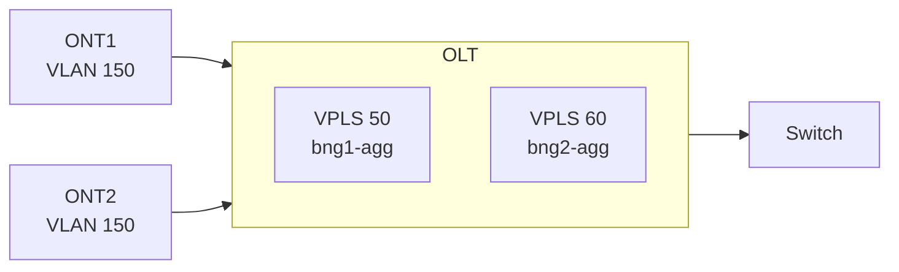
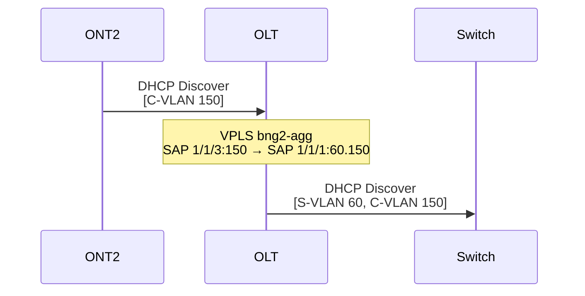

# OLT - Nokia 7250 IXR-ec

## Información General

| Parámetro | Valor |
|-----------|-------|
| **Hostname** | OLT-NOKIA |
| **Modelo** | Nokia 7250 IXR-ec (SRSIM) |
| **IP de Gestión** | 10.77.1.5 |
| **Puerto SSH** | 56678 |
| **Puerto gNMI** | 56671 → 57400 |
| **Puerto NETCONF** | 56672 → 830 |

## Función en la Topología

El OLT (Optical Line Terminal) actúa como **punto de agregación de ONTs**. En este laboratorio, simula un OLT que agrega el tráfico de múltiples ONTs y lo encamina hacia el BNG correspondiente usando servicios VPLS con etiquetado QinQ.



## Índice de Configuración

- [1. SYSTEM NAME](#1-system-name)
- [2. TIME](#2-time)
- [3. GRPC](#3-grpc)
- [4. NETCONF](#4-netconf)
- [5. SNMP](#5-snmp)
- [6. SSH](#6-ssh)
- [7. SYSTEM USERS PROFILES](#7-system-users-profiles)
- [8. SYSTEM USERS](#8-system-users)
- [9. LOGS](#9-logs)
- [10. PORTS](#10-ports)
- [11. VPLS](#11-vpls)

---

## 1. SYSTEM NAME

```text
/configure system
/configure system name "OLT-NOKIA"
```

---

## 2. TIME

```text
/configure system time
/configure system time zone
/configure system time zone standard
/configure system time zone standard name est
```

---

## 3. GRPC

```text
/configure system grpc admin-state enable
/configure system grpc allow-unsecure-connection
/configure system grpc gnmi auto-config-save true
```

---

## 4. NETCONF

```text
/configure system management-interface netconf listen admin-state enable
/configure system management-interface configuration-save configuration-backups 5
/configure system management-interface configuration-save incremental-saves false
/configure system management-interface netconf auto-config-save true
```

---

## 5. SNMP

```text
/configure system management-interface snmp packet-size 9216
/configure system management-interface snmp streaming admin-state enable
/configure system security snmp community "public" access-permissions r
/configure system security snmp community "public" version v2c
```

---

## 6. SSH

```text
/configure system login-control ssh inbound-max-sessions 30
/configure system security ssh server-cipher-list-v2 cipher 190 name aes256-ctr
/configure system security ssh server-cipher-list-v2 cipher 192 name aes192-ctr
/configure system security ssh server-cipher-list-v2 cipher 194 name aes128-ctr
/configure system security ssh server-cipher-list-v2 cipher 200 name aes128-cbc
/configure system security ssh server-cipher-list-v2 cipher 205 name 3des-cbc
/configure system security ssh server-cipher-list-v2 cipher 225 name aes192-cbc
/configure system security ssh server-cipher-list-v2 cipher 230 name aes256-cbc
/configure system security ssh client-cipher-list-v2 cipher 190 name aes256-ctr
/configure system security ssh client-cipher-list-v2 cipher 192 name aes192-ctr
/configure system security ssh client-cipher-list-v2 cipher 194 name aes128-ctr
/configure system security ssh client-cipher-list-v2 cipher 200 name aes128-cbc
/configure system security ssh client-cipher-list-v2 cipher 205 name 3des-cbc
/configure system security ssh client-cipher-list-v2 cipher 225 name aes192-cbc
/configure system security ssh client-cipher-list-v2 cipher 230 name aes256-cbc
/configure system security ssh server-mac-list-v2 mac 200 name hmac-sha2-512
/configure system security ssh server-mac-list-v2 mac 210 name hmac-sha2-256
/configure system security ssh server-mac-list-v2 mac 215 name hmac-sha1
/configure system security ssh server-mac-list-v2 mac 220 name hmac-sha1-96
/configure system security ssh server-mac-list-v2 mac 225 name hmac-md5
/configure system security ssh server-mac-list-v2 mac 240 name hmac-md5-96
/configure system security ssh client-mac-list-v2 mac 200 name hmac-sha2-512
/configure system security ssh client-mac-list-v2 mac 210 name hmac-sha2-256
/configure system security ssh client-mac-list-v2 mac 215 name hmac-sha1
/configure system security ssh client-mac-list-v2 mac 220 name hmac-sha1-96
/configure system security ssh client-mac-list-v2 mac 225 name hmac-md5
/configure system security ssh client-mac-list-v2 mac 240 name hmac-md5-96
```

---

## 7. SYSTEM USERS PROFILES

```text
/configure system security aaa local-profiles profile "administrative" default-action permit-all
/configure system security aaa local-profiles profile "administrative" entry 10 match "configure system security"
/configure system security aaa local-profiles profile "administrative" entry 10 action permit
/configure system security aaa local-profiles profile "administrative" entry 20 match "show system security"
/configure system security aaa local-profiles profile "administrative" entry 20 action permit
/configure system security aaa local-profiles profile "administrative" entry 30 match "tools perform security"
/configure system security aaa local-profiles profile "administrative" entry 30 action permit
/configure system security aaa local-profiles profile "administrative" entry 40 match "tools dump security"
/configure system security aaa local-profiles profile "administrative" entry 40 action permit
/configure system security aaa local-profiles profile "administrative" entry 42 match "tools dump system security"
/configure system security aaa local-profiles profile "administrative" entry 42 action permit
/configure system security aaa local-profiles profile "administrative" entry 50 match "admin system security"
/configure system security aaa local-profiles profile "administrative" entry 50 action permit
/configure system security aaa local-profiles profile "administrative" entry 100 match "configure li"
/configure system security aaa local-profiles profile "administrative" entry 100 action deny
/configure system security aaa local-profiles profile "administrative" entry 110 match "show li"
/configure system security aaa local-profiles profile "administrative" entry 110 action deny
/configure system security aaa local-profiles profile "administrative" entry 111 match "clear li"
/configure system security aaa local-profiles profile "administrative" entry 111 action deny
/configure system security aaa local-profiles profile "administrative" entry 112 match "tools dump li"
/configure system security aaa local-profiles profile "administrative" entry 112 action deny
/configure system security aaa local-profiles profile "administrative" entry 113 match "tools perform system security"
/configure system security aaa local-profiles profile "administrative" entry 113 action permit

/configure system security aaa local-profiles profile "administrative" netconf base-op-authorization action true
/configure system security aaa local-profiles profile "administrative" netconf base-op-authorization cancel-commit true
/configure system security aaa local-profiles profile "administrative" netconf base-op-authorization close-session true
/configure system security aaa local-profiles profile "administrative" netconf base-op-authorization commit true
/configure system security aaa local-profiles profile "administrative" netconf base-op-authorization copy-config true
/configure system security aaa local-profiles profile "administrative" netconf base-op-authorization create-subscription true
/configure system security aaa local-profiles profile "administrative" netconf base-op-authorization delete-config true
/configure system security aaa local-profiles profile "administrative" netconf base-op-authorization discard-changes true
/configure system security aaa local-profiles profile "administrative" netconf base-op-authorization edit-config true
/configure system security aaa local-profiles profile "administrative" netconf base-op-authorization get true
/configure system security aaa local-profiles profile "administrative" netconf base-op-authorization get-config true
/configure system security aaa local-profiles profile "administrative" netconf base-op-authorization get-data true
/configure system security aaa local-profiles profile "administrative" netconf base-op-authorization get-schema true
/configure system security aaa local-profiles profile "administrative" netconf base-op-authorization kill-session true
/configure system security aaa local-profiles profile "administrative" netconf base-op-authorization lock true
/configure system security aaa local-profiles profile "administrative" netconf base-op-authorization validate true

/configure system security aaa local-profiles profile "default" entry 10 match "exec"
/configure system security aaa local-profiles profile "default" entry 10 action permit
/configure system security aaa local-profiles profile "default" entry 20 match "exit"
/configure system security aaa local-profiles profile "default" entry 20 action permit
/configure system security aaa local-profiles profile "default" entry 30 match "help"
/configure system security aaa local-profiles profile "default" entry 30 action permit
/configure system security aaa local-profiles profile "default" entry 40 match "logout"
/configure system security aaa local-profiles profile "default" entry 40 action permit
/configure system security aaa local-profiles profile "default" entry 50 match "password"
/configure system security aaa local-profiles profile "default" entry 50 action permit
/configure system security aaa local-profiles profile "default" entry 60 match "show config"
/configure system security aaa local-profiles profile "default" entry 60 action deny
/configure system security aaa local-profiles profile "default" entry 65 match "show li"
/configure system security aaa local-profiles profile "default" entry 65 action deny
/configure system security aaa local-profiles profile "default" entry 66 match "clear li"
/configure system security aaa local-profiles profile "default" entry 66 action deny
/configure system security aaa local-profiles profile "default" entry 67 match "tools dump li"
/configure system security aaa local-profiles profile "default" entry 67 action deny
/configure system security aaa local-profiles profile "default" entry 70 match "show"
/configure system security aaa local-profiles profile "default" entry 70 action permit
/configure system security aaa local-profiles profile "default" entry 75 match "state"
/configure system security aaa local-profiles profile "default" entry 75 action permit
/configure system security aaa local-profiles profile "default" entry 80 match "enable-admin"
/configure system security aaa local-profiles profile "default" entry 80 action permit
/configure system security aaa local-profiles profile "default" entry 90 match "enable"
/configure system security aaa local-profiles profile "default" entry 90 action permit
/configure system security aaa local-profiles profile "default" entry 100 match "configure li"
/configure system security aaa local-profiles profile "default" entry 100 action deny
```

---

## 8. SYSTEM USERS

```text
/configure system security user-params local-user user "admin" restricted-to-home false
/configure system security user-params local-user user "admin" access console true
/configure system security user-params local-user user "admin" access ftp true
/configure system security user-params local-user user "admin" access netconf true
/configure system security user-params local-user user "admin" access grpc true
/configure system security user-params local-user user "admin" password "lab123"
/configure system security user-params local-user user "admin" restricted-to-home false
/configure system security user-params local-user user "admin" access console true
/configure system security user-params local-user user "admin" console member ["administrative"] 
```

---

## 9. LOGS

```text
/configure log filter "1001" named-entry "10" description "Collect only events of major severity or higher"
/configure log filter "1001" named-entry "10" action forward
/configure log filter "1001" named-entry "10" match severity gte major
/configure log log-id "99" description "Default System Log"
/configure log log-id "99" source main true
/configure log log-id "99" destination memory max-entries 500
/configure log log-id "100" description "Default Serious Errors Log"
/configure log log-id "100" filter "1001"
/configure log log-id "100" source main true
/configure log log-id "100" destination memory max-entries 500
```

---

## 10. PORTS

### 10.1 PORT TO SWITCH

```text
/configure port 1/1/1 admin-state enable
/configure port 1/1/1 ethernet mode hybrid
/configure port 1/1/1 ethernet encap-type qinq
```

!!! info "Modo Hybrid con QinQ"
    
    El puerto hacia el Switch usa encapsulación QinQ para transportar tanto la S-VLAN (50 o 60) como la C-VLAN (150) del cliente.

### 10.2 PORT TO ONT1

```text
/configure port 1/1/2 admin-state enable
/configure port 1/1/2 ethernet mode access
/configure port 1/1/2 ethernet encap-type dot1q
```

### 10.3 PORT TO ONT2

```text
/configure port 1/1/3 admin-state enable
/configure port 1/1/3 ethernet mode access
/configure port 1/1/3 ethernet encap-type dot1q
```

!!! note "Puertos de Acceso"
    
    Los puertos hacia las ONTs usan encapsulación 802.1Q (dot1q) y modo access para recibir tráfico con una sola etiqueta VLAN (C-VLAN 150).

---

## 11. VPLS

### 11.1 VPLS BNG1 (bng1-agg)

Este VPLS agrega el tráfico de ONT1 y lo encamina hacia BNG1:

```text
/configure service vpls "bng1-agg" admin-state enable
/configure service vpls "bng1-agg" service-id 50
/configure service vpls "bng1-agg" customer "1"
/configure service vpls "bng1-agg" stp admin-state disable

# SAP hacia Switch con QinQ (S-VLAN 50, C-VLAN 150)
/configure service vpls "bng1-agg" sap 1/1/1:50.150 admin-state enable

# SAP hacia ONT1 con C-VLAN 150
/configure service vpls "bng1-agg" sap 1/1/2:150 admin-state enable
```

### 11.2 VPLS BNG2 (bng2-agg)

Este VPLS agrega el tráfico de ONT2 y lo encamina hacia BNG2:

```text
/configure service vpls "bng2-agg" admin-state enable
/configure service vpls "bng2-agg" service-id 60
/configure service vpls "bng2-agg" customer "1"
/configure service vpls "bng2-agg" stp admin-state disable

# SAP hacia Switch con QinQ (S-VLAN 60, C-VLAN 150)
/configure service vpls "bng2-agg" sap 1/1/1:60.150 admin-state enable

# SAP hacia ONT2 con C-VLAN 150
/configure service vpls "bng2-agg" sap 1/1/3:150 admin-state enable
```

---

## Tabla de Puertos

| Puerto | Modo | Encapsulación | Conexión |
|--------|------|---------------|----------|
| 1/1/1 | Hybrid | QinQ | Switch:1/1/3 |
| 1/1/2 | Access | 802.1Q | ONT1:eth1 |
| 1/1/3 | Access | 802.1Q | ONT2:eth1 |

## Tabla de Servicios VPLS

| VPLS | Service ID | SAP Switch | SAP ONT | Descripción |
|------|------------|------------|---------|-------------|
| bng1-agg | 50 | 1/1/1:50.150 | 1/1/2:150 | Tráfico ONT1 → BNG1 |
| bng2-agg | 60 | 1/1/1:60.150 | 1/1/3:150 | Tráfico ONT2 → BNG2 |

## Flujo de Tráfico

### ONT1 hacia BNG1


### ONT2 hacia BNG2



## Verificación

### Ver estado de puertos

```bash
show port
show port 1/1/1 detail
show port 1/1/2 detail
show port 1/1/3 detail
```

### Ver servicios VPLS

```bash
show service service-using vpls
show service id 50 base
show service id 60 base
```

### Ver SAPs

```bash
show service id 50 sap
show service id 60 sap
```

### Ver estadísticas de SAP

```bash
show service id 50 sap 1/1/2:150 stats
show service id 60 sap 1/1/3:150 stats
```

### Ver FDB (Forwarding Database)

```bash
show service id 50 fdb detail
show service id 60 fdb detail
```

## Escalabilidad

### Agregar una nueva ONT a BNG1

```text
# Habilitar puerto
/configure port 1/1/4 admin-state enable
/configure port 1/1/4 ethernet mode access
/configure port 1/1/4 ethernet encap-type dot1q

# Agregar SAP al VPLS existente
/configure service vpls "bng1-agg" sap 1/1/4:150 admin-state enable
```

### Agregar una nueva ONT a BNG2

```text
# Habilitar puerto
/configure port 1/1/5 admin-state enable
/configure port 1/1/5 ethernet mode access
/configure port 1/1/5 ethernet encap-type dot1q

# Agregar SAP al VPLS existente
/configure service vpls "bng2-agg" sap 1/1/5:150 admin-state enable
```

### Agregar soporte para BNG3

```text
# Crear nuevo VPLS
/configure service vpls "bng3-agg" admin-state enable
/configure service vpls "bng3-agg" service-id 70
/configure service vpls "bng3-agg" customer "1"
/configure service vpls "bng3-agg" stp admin-state disable

# SAP hacia Switch
/configure service vpls "bng3-agg" sap 1/1/1:70.150 admin-state enable

# SAP hacia nueva ONT
/configure service vpls "bng3-agg" sap 1/1/6:150 admin-state enable
```
