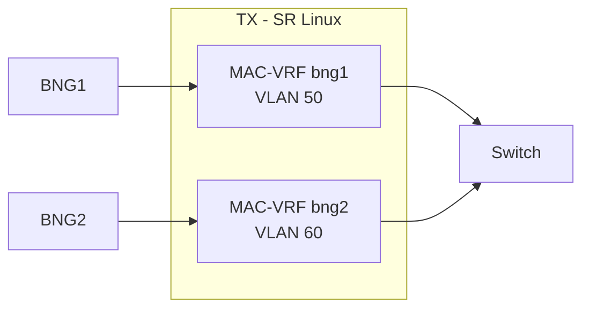
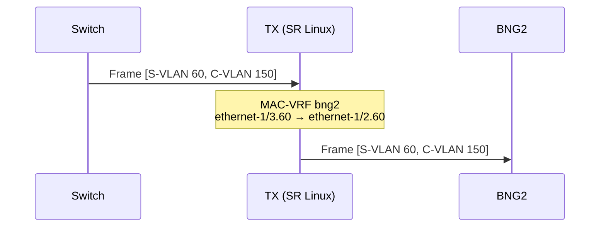

# TX - Nokia SR Linux

## Información General

| Parámetro | Valor |
|-----------|-------|
| **Hostname** | tx |
| **Modelo** | Nokia SR Linux |
| **Imagen** | ghcr.io/nokia/srlinux:25.10 |
| **IP de Gestión** | 10.77.1.16 |
| **Puerto SSH** | 56676 |

## Función en la Topología

El TX actúa como **switch de transporte** entre los BNGs y la red de acceso. Utiliza **MAC-VRF** para crear dominios de bridge separados que dirigen el tráfico hacia el BNG correspondiente según la S-VLAN.



## Índice de Configuración

- [1. INTERFACES](#1-interfaces)
- [2. MAC-VRF](#2-mac-vrf)
- [3. PASSWORD](#3-password)

---

## 1. INTERFACES

### 1.1 INTERFACE TO BNG1

```text
set /interface ethernet-1/1 admin-state enable
set /interface ethernet-1/1 vlan-tagging true
set /interface ethernet-1/1 subinterface 50 type bridged
set /interface ethernet-1/1 subinterface 50 admin-state enable
set /interface ethernet-1/1 subinterface 50 vlan encap single-tagged vlan-id 50
```

### 1.2 INTERFACE TO BNG2

```text
set /interface ethernet-1/2 admin-state enable
set /interface ethernet-1/2 vlan-tagging true
set /interface ethernet-1/2 subinterface 60 type bridged
set /interface ethernet-1/2 subinterface 60 admin-state enable
set /interface ethernet-1/2 subinterface 60 vlan encap single-tagged vlan-id 60
```

### 1.3 INTERFACE TO SWITCH

```text
set /interface ethernet-1/3 admin-state enable
set /interface ethernet-1/3 vlan-tagging true

# Subinterface para BNG1 (VLAN 50)
set /interface ethernet-1/3 subinterface 50 type bridged
set /interface ethernet-1/3 subinterface 50 admin-state enable
set /interface ethernet-1/3 subinterface 50 vlan encap single-tagged vlan-id 50

# Subinterface para BNG2 (VLAN 60)
set /interface ethernet-1/3 subinterface 60 type bridged
set /interface ethernet-1/3 subinterface 60 admin-state enable
set /interface ethernet-1/3 subinterface 60 vlan encap single-tagged vlan-id 60
```

### 1.4 TPID FOR QINQ

```text
set /interface ethernet-1/1 tpid TPID_ANY
set /interface ethernet-1/2 tpid TPID_ANY
set /interface ethernet-1/3 tpid TPID_ANY
```

!!! info "TPID_ANY"
    
    La configuración `tpid TPID_ANY` permite al SR Linux aceptar cualquier valor de TPID en las tramas, facilitando la interoperabilidad con equipos que usan diferentes valores de TPID para QinQ (0x8100, 0x88a8, etc.)

---

## 2. MAC-VRF

### 2.1 MAC-VRF BNG1

```text
set /network-instance bng1 type mac-vrf
set /network-instance bng1 admin-state enable
set /network-instance bng1 interface ethernet-1/1.50
set /network-instance bng1 interface ethernet-1/3.50
```

### 2.2 MAC-VRF BNG2

```text
set /network-instance bng2 type mac-vrf
set /network-instance bng2 admin-state enable
set /network-instance bng2 interface ethernet-1/2.60
set /network-instance bng2 interface ethernet-1/3.60
```

---

## 3. PASSWORD

```text
set / system aaa authentication admin-user password lab123
```

---

## Tabla de Interfaces

| Interface | Subinterface | VLAN | MAC-VRF | Conexión |
|-----------|--------------|------|---------|----------|
| ethernet-1/1 | 50 | 50 | bng1 | BNG1:1/1/c1/1 |
| ethernet-1/2 | 60 | 60 | bng2 | BNG2:1/1/c1/1 |
| ethernet-1/3 | 50 | 50 | bng1 | Switch:1/1/1 |
| ethernet-1/3 | 60 | 60 | bng2 | Switch:1/1/1 |

## Flujo de Tráfico

### Tráfico hacia BNG1 (VLAN 50)


### Tráfico hacia BNG2 (VLAN 60)



## Verificación

### Ver estado de interfaces

```bash
A:tx# show interface brief
```

### Ver MAC-VRF

```bash
A:tx# show network-instance bng1 summary
A:tx# show network-instance bng2 summary
```

### Ver tabla MAC

```bash
A:tx# show network-instance bng1 bridge-table mac-table all
A:tx# show network-instance bng2 bridge-table mac-table all
```

### Ver estadísticas de interfaz

```bash
A:tx# show interface ethernet-1/1 statistics
A:tx# show interface ethernet-1/2 statistics
A:tx# show interface ethernet-1/3 statistics
```

## Escalabilidad

Para agregar un tercer BNG:

```text
# Nueva interfaz hacia BNG3
set /interface ethernet-1/4 admin-state enable
set /interface ethernet-1/4 vlan-tagging true
set /interface ethernet-1/4 tpid TPID_ANY
set /interface ethernet-1/4 subinterface 70 type bridged
set /interface ethernet-1/4 subinterface 70 admin-state enable
set /interface ethernet-1/4 subinterface 70 vlan encap single-tagged vlan-id 70

# Nueva subinterface hacia Switch
set /interface ethernet-1/3 subinterface 70 type bridged
set /interface ethernet-1/3 subinterface 70 admin-state enable
set /interface ethernet-1/3 subinterface 70 vlan encap single-tagged vlan-id 70

# Nuevo MAC-VRF
set /network-instance bng3 type mac-vrf
set /network-instance bng3 admin-state enable
set /network-instance bng3 interface ethernet-1/4.70
set /network-instance bng3 interface ethernet-1/3.70
```
