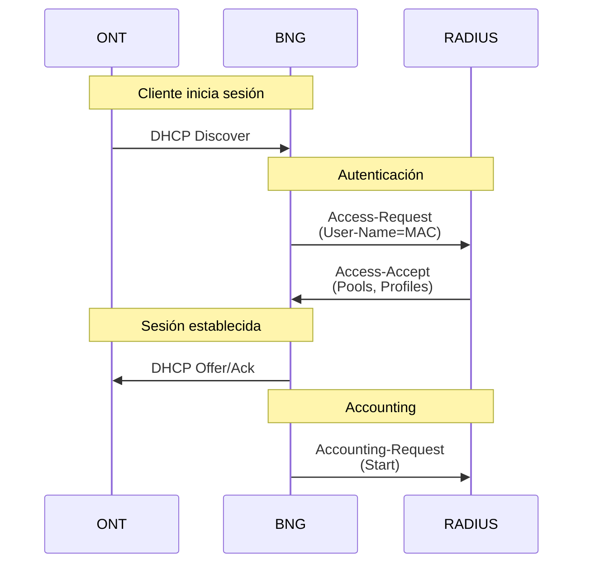

# Servidor RADIUS

## Descripción

El laboratorio utiliza **FreeRADIUS** como servidor de autenticación para los suscriptores. El servidor RADIUS valida las credenciales de las ONTs basándose en su dirección MAC y devuelve los atributos de servicio que el BNG utiliza para configurar la sesión.

## Información del Servidor

| Parámetro | Valor |
|-----------|-------|
| **Imagen** | ghcr.io/srl-labs/network-multitool |
| **IP de Gestión** | 10.77.1.10 |
| **Puerto Auth** | 1812/UDP |
| **Puerto Acct** | 1813/UDP |
| **Secret** | testlab123 |

## Arquitectura



## Configuración

### Clientes RADIUS

```text
# configs/radius/clients.tmpl.conf

client bng1 {
    ipaddr = 10.77.1.2
    secret = testlab123
}

client bng2 {
    ipaddr = 10.77.1.3
    secret = testlab123
}
```

### Script de Inicio

```bash
# configs/radius/radius.sh

ifup -a

mkdir -p /home/user/.ssh
touch /home/user/.ssh/authorized_keys
chmod 600 /home/user/.ssh/authorized_keys
cat /tmp/authorized_keys > /home/user/.ssh/authorized_keys
chown -R user:user /home/user/.ssh

echo "user ALL=(ALL) NOPASSWD: ALL" >> /etc/sudoers
echo "user:test" | chpasswd

/usr/sbin/radiusd -x
```

## Atributos Nokia (VSA)

FreeRADIUS utiliza los siguientes atributos vendor-specific de Nokia (Alcatel-Lucent):

| Atributo | Descripción |
|----------|-------------|
| `Framed-Pool` | Pool de direcciones IPv4 |
| `Framed-IPv6-Pool` | Pool de direcciones IPv6 WAN |
| `Alc-Delegated-IPv6-Pool` | Pool para Prefix Delegation |
| `Alc-SLA-Prof-str` | Nombre del perfil SLA |
| `Alc-Subsc-Prof-str` | Nombre del perfil de suscriptor |
| `Alc-Subsc-ID-Str` | Identificador único del suscriptor |

## Configuración en lab.yml

```yaml
radius:
  kind: linux
  group: server
  mgmt-ipv4: 10.77.1.10
  image: ghcr.io/srl-labs/network-multitool
  binds:
    - configs/radius/interfaces.tmpl:/etc/network/interfaces
    - configs/radius/clients.tmpl.conf:/etc/raddb/clients.conf
    - configs/radius/radiusd.conf:/etc/raddb/radiusd.conf
    - configs/radius/authorize:/etc/raddb/mods-config/files/authorize
    - configs/radius/radius.sh:/client.sh
  exec:
    - bash /client.sh
    - bash -c "echo 'nameserver 10.77.1.10 ' | sudo tee /etc/resolv.conf"
  env:
    USER_PASSWORD: test
```

## Verificación

### Ver estado del servidor

```bash
# Acceder al contenedor
docker exec -it radius bash

# Ver proceso radiusd
ps aux | grep radiusd

# Ver logs en tiempo real
tail -f /var/log/radius/radius.log
```

### Test de autenticación

```bash
# Desde el contenedor RADIUS
radtest 00:d0:f6:01:01:01 testlab123 localhost 0 testing123

# Respuesta esperada
Received Access-Accept Id 123 from 127.0.0.1:1812 to 127.0.0.1:12345
    Framed-Pool = "cgnat"
    Framed-IPv6-Pool = "IPv6"
    Alc-Delegated-IPv6-Pool = "IPv6"
    Alc-SLA-Prof-str = "100M"
    Alc-Subsc-Prof-str = "subprofile"
    Alc-Subsc-ID-Str = "ONT-001"
```

### Debug de RADIUS

```bash
# Detener el servicio
pkill radiusd

# Iniciar en modo debug
radiusd -X
```

## Troubleshooting

!!! warning "Problemas Comunes"
    
    **Access-Reject**
    
    - Verificar que la MAC está en el archivo `authorize`
    - Verificar que el password coincide
    - Revisar formato de la MAC (minúsculas, con dos puntos)
    
    **Sin respuesta del servidor**
    
    - Verificar que el cliente está configurado con la IP correcta del BNG
    - Verificar que el secret coincide
    - Verificar conectividad: `ping 10.77.1.10`
    
    **Atributos no aplicados en BNG**
    
    - Verificar que los nombres de perfiles coinciden con los configurados en el BNG
    - Verificar que los pools existen en el BNG
