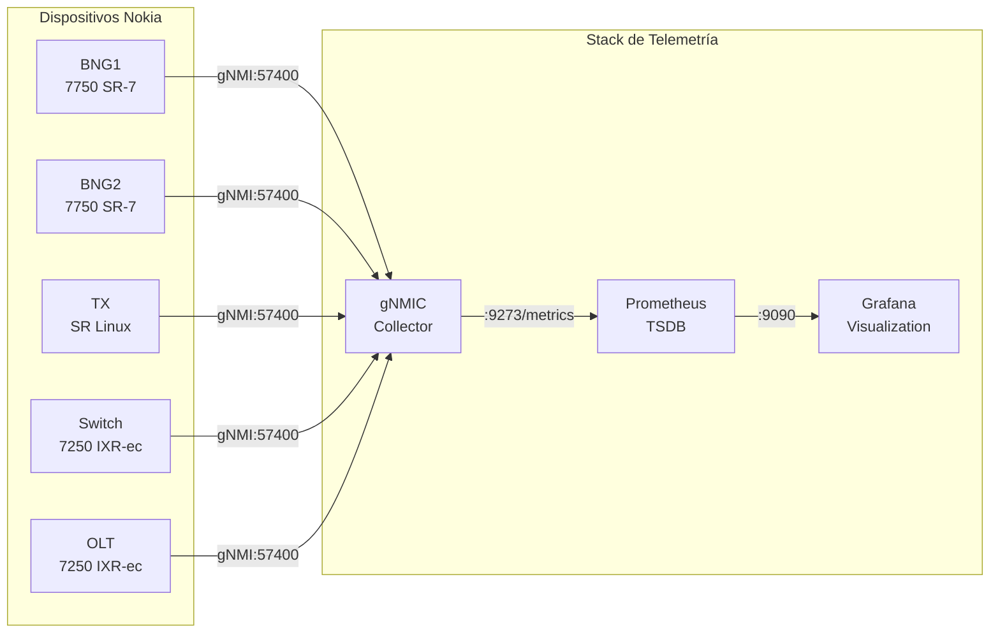
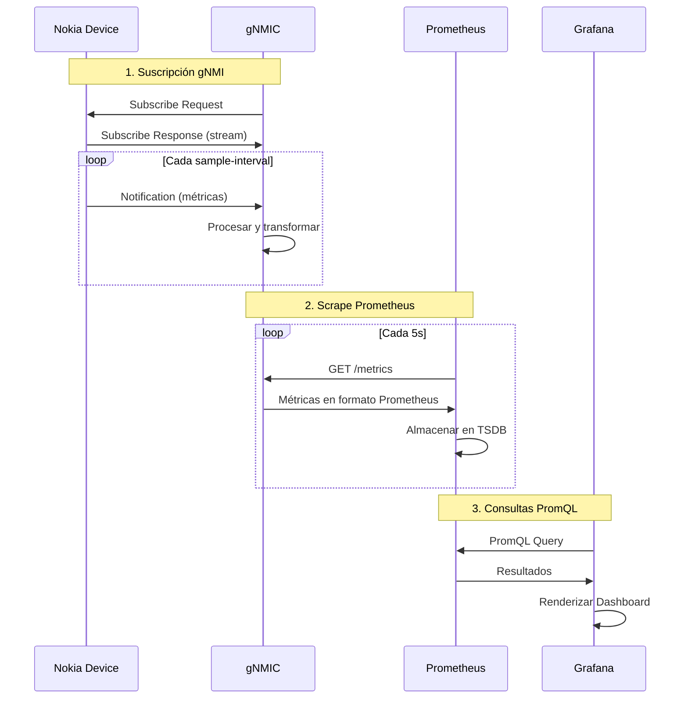

# Stack de Telemetría

## Arquitectura de Monitoreo

El laboratorio implementa un stack de telemetría moderno basado en **gNMI (gRPC Network Management Interface)** para la recolección de métricas en tiempo real de todos los dispositivos Nokia.



## Componentes

<div class="grid cards" markdown>

-   :material-database-export:{ .lg .middle } __gNMIC__

    ---
    
    Colector de telemetría gNMI que se suscribe a métricas de los dispositivos y las expone en formato Prometheus
    
    [:octicons-arrow-right-24: Configuración](gnmic.md)

-   :material-database:{ .lg .middle } __Prometheus__

    ---
    
    Base de datos de series temporales que almacena las métricas recolectadas por gNMIC
    
    [:octicons-arrow-right-24: Configuración](prometheus.md)

-   :material-chart-areaspline:{ .lg .middle } __Grafana__

    ---
    
    Plataforma de visualización con dashboards predefinidos para Nokia SROS y SR Linux
    
    [:octicons-arrow-right-24: Configuración](grafana.md)

</div>

## Métricas Recolectadas

### Nokia SROS (BNG, Switch, OLT)

| Categoría | Métricas |
|-----------|----------|
| **Puertos** | Estado operacional, estadísticas de tráfico, errores |
| **BGP** | Estadísticas de sesión, rutas por familia |
| **Interfaces** | Estadísticas IPv4/IPv6, contadores |
| **ISIS** | Estadísticas del protocolo |
| **Tabla de Rutas** | Contadores IPv4/IPv6 |
| **Sistema** | CPU, memoria, temperatura |
| **Servicios** | Estado operacional VPLS/VPRN |
| **Subscriber Mgmt** | Local User DB, sesiones |

### Nokia SR Linux (TX)

| Categoría | Métricas |
|-----------|----------|
| **Platform** | CPU, memoria |
| **Interfaces** | Estadísticas, estado operacional, traffic-rate |
| **Network Instance** | Estado, estadísticas de rutas |
| **BGP** | Estadísticas de grupo y globales |
| **LAG** | Estadísticas LACP |
| **Applications** | Estado de aplicaciones del sistema |

## Acceso a los Servicios

| Servicio | URL | Credenciales |
|----------|-----|--------------|
| Grafana | http://localhost:3030 | admin / admin |
| Prometheus | http://localhost:9090 | N/A |
| gNMIC Metrics | http://gnmic:9273/metrics | N/A |

## Flujo de Datos



## Configuración en lab.yml

```yaml
gnmic:
  kind: linux
  group: server
  mgmt-ipv4: 10.77.1.12
  image: ghcr.io/openconfig/gnmic:latest
  binds:
    - configs/gnmic/config.yml:/gnmic-config.yml:ro
    - /var/run/docker.sock:/var/run/docker.sock:ro
  cmd: --config /gnmic-config.yml --log subscribe
  env:
    GNMIC_PASSWORD: lab123

prometheus:
  kind: linux
  group: server
  mgmt-ipv4: 10.77.1.13
  image: prom/prometheus
  binds:
    - configs/prometheus/prometheus.yml:/etc/prometheus/prometheus.yml:ro
  ports:
    - 9090:9090
  cmd: --config.file=/etc/prometheus/prometheus.yml

grafana:
  kind: linux
  group: server
  mgmt-ipv4: 10.77.1.14
  image: grafana/grafana:10.3.5
  binds:
    - configs/grafana/datasource.yml:/etc/grafana/provisioning/datasources/datasource.yaml:ro
    - configs/grafana/dashboards.yml:/etc/grafana/provisioning/dashboards/dashboards.yaml:ro
    - configs/grafana/dashboards:/var/lib/grafana/dashboards
  ports:
    - 3030:3000
  env:
    GF_SECURITY_ADMIN_PASSWORD: admin
```

## Verificación del Stack

### Verificar gNMIC

```bash
# Ver logs de gNMIC
docker logs gnmic

# Verificar métricas expuestas
curl http://10.77.1.12:9273/metrics | head -50
```

### Verificar Prometheus

```bash
# Acceder a la UI
firefox http://localhost:9090

# Verificar targets
curl http://localhost:9090/api/v1/targets
```

### Verificar Grafana

```bash
# Acceder a la UI
firefox http://localhost:3030

# Login: admin / admin
```

## Troubleshooting

!!! warning "Problemas Comunes"
    
    **gNMIC no conecta a dispositivos**
    
    - Verificar que gRPC está habilitado en el dispositivo
    - Verificar credenciales (admin/lab123)
    - Verificar puerto 57400 accesible
    
    **Prometheus no tiene datos**
    
    - Verificar que gNMIC está exponiendo métricas
    - Revisar target status en Prometheus UI
    
    **Grafana sin datos**
    
    - Verificar datasource Prometheus está configurado
    - Verificar queries en los paneles
