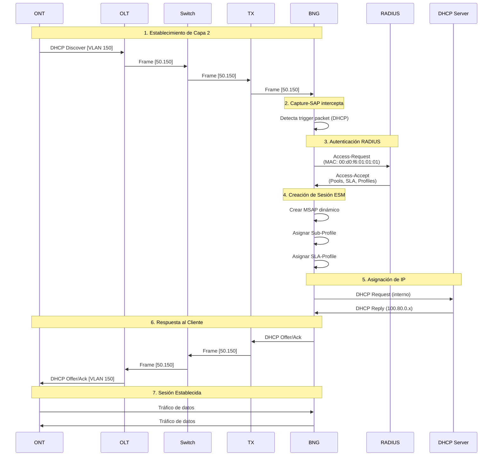

# Flujo de Autenticación de ONTs

## Descripción General

El flujo de autenticación de equipos ONT implementa el modelo **ESM (Enhanced Subscriber Management)** de Nokia SROS. Este proceso permite la autenticación dinámica de suscriptores utilizando RADIUS para asignar perfiles de servicio, direcciones IP y políticas de QoS.

## Diagrama de Secuencia



## Fases del Proceso

### Fase 1: Trigger de Sesión

Cuando una ONT envía un paquete DHCP Discovery, PPPoE PADI, o DHCPv6 Solicit, el **Capture-SAP** del BNG intercepta el tráfico:

```text
/configure service vpls "capture-sap" capture-sap 1/1/c1/1:*.* trigger-packet
/configure service vpls "capture-sap" capture-sap 1/1/c1/1:*.* trigger-packet dhcp true
/configure service vpls "capture-sap" capture-sap 1/1/c1/1:*.* trigger-packet dhcp6 true
/configure service vpls "capture-sap" capture-sap 1/1/c1/1:*.* trigger-packet pppoe true
```

!!! info "Tipos de Trigger"
    
    - **DHCP**: Para sesiones IPoE con DHCPv4
    - **DHCPv6**: Para sesiones IPoE con Dual-Stack
    - **PPPoE**: Para sesiones PPPoE (PADI/PADO/PADR/PADS)

### Fase 2: Consulta RADIUS

El BNG extrae la MAC address del paquete y realiza una consulta RADIUS:

```text
# Política de autenticación RADIUS
/configure subscriber-mgmt radius-accounting-policy "accpolicy"
/configure subscriber-mgmt radius-accounting-policy "accpolicy" update-interval 30

/configure subscriber-mgmt authentication-policy "autpolicy"
/configure subscriber-mgmt authentication-policy "autpolicy" password "testlab123"
/configure subscriber-mgmt authentication-policy "autpolicy" user-name-format mac
/configure subscriber-mgmt authentication-policy "autpolicy" radius-server-policy "radius-pol"
```

**Atributos enviados en Access-Request:**

| Atributo | Valor | Descripción |
|----------|-------|-------------|
| User-Name | 00:d0:f6:01:01:01 | MAC de la ONT |
| User-Password | testlab123 | Password estático |
| NAS-IP-Address | 10.77.1.2 | IP del BNG |
| NAS-Port-Id | 1/1/c1/1:50.150 | SAP del suscriptor |
| Calling-Station-Id | 00:d0:f6:01:01:01 | MAC del cliente |

### Fase 3: Respuesta RADIUS

El servidor RADIUS valida las credenciales y devuelve los atributos de servicio:

```text
# Archivo authorize en FreeRADIUS
00:d0:f6:01:01:01   Cleartext-Password := "testlab123"
                    Framed-Pool = "cgnat",
                    Framed-IPv6-Pool = "IPv6",
                    Alc-Delegated-IPv6-Pool = "IPv6",
                    Alc-SLA-Prof-str = "100M",
                    Alc-Subsc-Prof-str = "subprofile",
                    Alc-Subsc-ID-Str = "ONT-001",
                    Fall-Through = Yes
```

**Atributos devueltos en Access-Accept:**

| Atributo | Valor | Función |
|----------|-------|---------|
| Framed-Pool | cgnat | Pool IPv4 para CGNAT |
| Framed-IPv6-Pool | IPv6 | Pool para direcciones WAN IPv6 |
| Alc-Delegated-IPv6-Pool | IPv6 | Pool para Prefix Delegation |
| Alc-SLA-Prof-str | 100M | Perfil SLA (ancho de banda) |
| Alc-Subsc-Prof-str | subprofile | Perfil de suscriptor |
| Alc-Subsc-ID-Str | ONT-001 | Identificador único |

### Fase 4: Creación de Sesión ESM

El BNG crea dinámicamente un **MSAP (Managed SAP)** y aplica los perfiles:

```text
# Sub-Profile (definido en BNG)
/configure subscriber-mgmt sub-profile "subprofile"
/configure subscriber-mgmt sub-profile "subprofile" sla-profile-map entry 1 sla-profile "100M"

# SLA-Profile (define QoS y políticas)
/configure subscriber-mgmt sla-profile "100M"
/configure subscriber-mgmt sla-profile "100M" ingress qos sap-ingress-policy "100M"
/configure subscriber-mgmt sla-profile "100M" egress qos sap-egress-policy "100M"
```

### Fase 5: Asignación de Direcciones

#### IPv4 (CGNAT)

```text
# Pool CGNAT
/configure service vprn "9998" dhcp-server dhcpv4 "suscriptores" 
/configure service vprn "9998" dhcp-server dhcpv4 "suscriptores" pool "cgnat"
/configure service vprn "9998" dhcp-server dhcpv4 "suscriptores" pool "cgnat" subnet 100.64.0.0/10
/configure service vprn "9998" dhcp-server dhcpv4 "suscriptores" pool "cgnat" subnet 100.64.0.0/10 address-range
/configure service vprn "9998" dhcp-server dhcpv4 "suscriptores" pool "cgnat" subnet 100.64.0.0/10 address-range start 100.64.0.10
/configure service vprn "9998" dhcp-server dhcpv4 "suscriptores" pool "cgnat" subnet 100.64.0.0/10 address-range end 100.64.0.254
```

#### IPv6 (Dual-Stack con Prefix Delegation)

```text
# Pool IPv6 con WAN y PD
/configure service vprn "9998" dhcp-server dhcpv6 "suscriptores_v6"
/configure service vprn "9998" dhcp-server dhcpv6 "suscriptores_v6" pool "IPv6"
/configure service vprn "9998" dhcp-server dhcpv6 "suscriptores_v6" pool "IPv6" delegated-prefix
/configure service vprn "9998" dhcp-server dhcpv6 "suscriptores_v6" pool "IPv6" delegated-prefix prefix 2001:db8:200::/48
/configure service vprn "9998" dhcp-server dhcpv6 "suscriptores_v6" pool "IPv6" delegated-prefix prefix 2001:db8:200::/48 length
/configure service vprn "9998" dhcp-server dhcpv6 "suscriptores_v6" pool "IPv6" delegated-prefix prefix 2001:db8:200::/48 length minimum 56
/configure service vprn "9998" dhcp-server dhcpv6 "suscriptores_v6" pool "IPv6" delegated-prefix prefix 2001:db8:200::/48 length maximum 64
```

## Subscriber Interface y Group Interface

### Subscriber Interface

```text
/configure service vprn "9998" subscriber-interface "services"
/configure service vprn "9998" subscriber-interface "services" admin-state enable
/configure service vprn "9998" subscriber-interface "services" wan-mode mode128

# IPv4
/configure service vprn "9998" subscriber-interface "services" ipv4
/configure service vprn "9998" subscriber-interface "services" ipv4 address 100.80.0.1
/configure service vprn "9998" subscriber-interface "services" ipv4 address 100.80.0.1 prefix-length 29

# IPv6
/configure service vprn "9998" subscriber-interface "services" ipv6 prefix 2001:db8:100::/56 host-type wan
/configure service vprn "9998" subscriber-interface "services" ipv6 prefix 2001:db8:200::/48 host-type pd
```

### Group Interface

```text
/configure service vprn "9998" subscriber-interface "services" group-interface "gi"
/configure service vprn "9998" subscriber-interface "services" group-interface "gi" admin-state enable
/configure service vprn "9998" subscriber-interface "services" group-interface "gi" radius-auth-policy "autpolicy"

# IPoE Session
/configure service vprn "9998" subscriber-interface "services" group-interface "gi" ipoe-session
/configure service vprn "9998" subscriber-interface "services" group-interface "gi" ipoe-session admin-state enable
/configure service vprn "9998" subscriber-interface "services" group-interface "gi" ipoe-session ipoe-session-policy "ipoe"

# PPPoE (opcional)
/configure service vprn "9998" subscriber-interface "services" group-interface "gi" pppoe
/configure service vprn "9998" subscriber-interface "services" group-interface "gi" pppoe admin-state enable
```

## Verificación de Sesiones

### Comandos de Verificación en BNG

```bash
# Ver sesiones activas
show service active-subscribers


```

## Troubleshooting

!!! warning "Problemas Comunes"
    
    **1. Sesión no se crea**
    
    - Verificar que el trigger packet está configurado
    - Verificar conectividad RADIUS
    - Revisar logs: `debug subscriber-mgmt`
    
    **2. RADIUS rechaza autenticación**
    
    - Verificar MAC en archivo authorize
    - Verificar secret compartido
    - Revisar logs de FreeRADIUS: `radiusd -X`
    
    **3. No se asigna IP**
    
    - Verificar pools DHCP tienen direcciones disponibles
    - Verificar que el atributo Framed-Pool coincide con el pool configurado
    - Revisar `show router 9998 dhcp local-dhcp-server statistics`

### Debug RADIUS

```bash
# Habilitar debug en BNG
```
