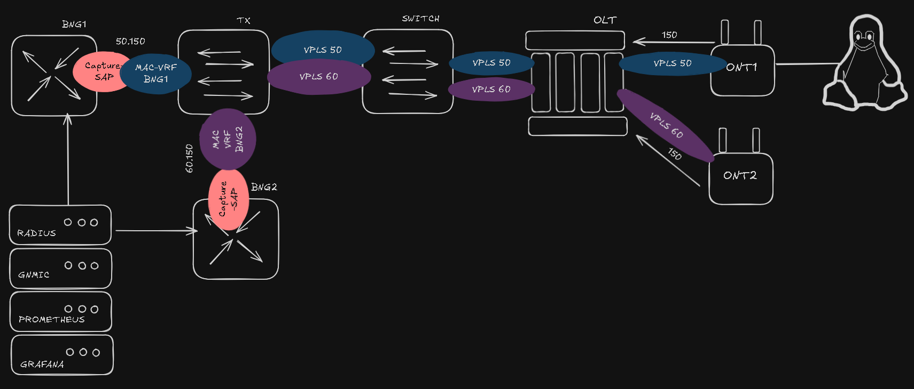
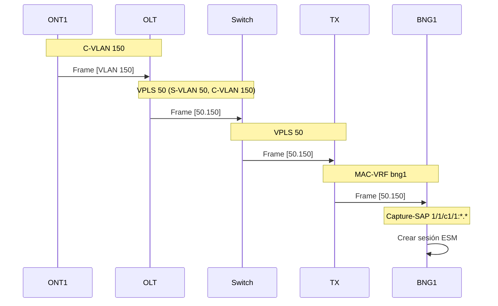

# Overlay Network

## Diagrama de Servicios Lógicos



## Descripción de la Capa de Servicios

El **Overlay** representa los servicios lógicos de capa 2 y capa 3 que operan sobre la infraestructura física. Esta capa define cómo el tráfico de los suscriptores es transportado desde las ONTs hasta los BNGs correspondientes.

## Arquitectura de Servicios VPLS

La arquitectura utiliza **VPLS (Virtual Private LAN Service)** para crear dominios de broadcast aislados que conectan cada ONT con su BNG correspondiente.

### Esquema de VLANs

| Servicio | S-VLAN | C-VLAN | Descripción |
|----------|--------|--------|-------------|
| BNG1 | 50 | 150 | Tráfico hacia BNG1 |
| BNG2 | 60 | 150 | Tráfico hacia BNG2 |

!!! info "Etiquetado QinQ"
    
    - **C-VLAN (Customer VLAN)**: VLAN 150 asignada al cliente en la ONT
    - **S-VLAN (Service VLAN)**: VLAN 50 o 60 para identificar el BNG destino

## Configuración de Servicios por Dispositivo

### OLT - VPLS de Agregación

El OLT crea dos VPLS que agregan el tráfico de las ONTs hacia los BNGs:

=== "VPLS para BNG1 (Service ID 50)"

    ```text
    /configure service vpls "bng1-agg" admin-state enable
    /configure service vpls "bng1-agg" service-id 50
    /configure service vpls "bng1-agg" customer "1"
    /configure service vpls "bng1-agg" stp admin-state disable
    
    # SAP hacia Switch con QinQ (S-VLAN.C-VLAN)
    /configure service vpls "bng1-agg" sap 1/1/1:50.150 admin-state enable
    
    # SAP hacia ONT1 con C-VLAN
    /configure service vpls "bng1-agg" sap 1/1/2:150 admin-state enable
    ```

=== "VPLS para BNG2 (Service ID 60)"

    ```text
    /configure service vpls "bng2-agg" admin-state enable
    /configure service vpls "bng2-agg" service-id 60
    /configure service vpls "bng2-agg" customer "1"
    /configure service vpls "bng2-agg" stp admin-state disable
    
    # SAP hacia Switch con QinQ (S-VLAN.C-VLAN)
    /configure service vpls "bng2-agg" sap 1/1/1:60.150 admin-state enable
    
    # SAP hacia ONT2 con C-VLAN
    /configure service vpls "bng2-agg" sap 1/1/3:150 admin-state enable
    ```

### Switch - VPLS de Transporte

El Switch transporta el tráfico QinQ entre el OLT y el TX:

=== "VPLS hacia BNG1"

    ```text
    /configure service vpls "to-tx-50" admin-state enable
    /configure service vpls "to-tx-50" service-id 50
    /configure service vpls "to-tx-50" customer "1"
    /configure service vpls "to-tx-50" stp admin-state disable
    
    # SAP hacia TX
    /configure service vpls "to-tx-50" sap 1/1/1:50.* admin-state enable
    
    # SAP hacia OLT
    /configure service vpls "to-tx-50" sap 1/1/3:50.* admin-state enable
    ```

=== "VPLS hacia BNG2"

    ```text
    /configure service vpls "to-tx-60" admin-state enable
    /configure service vpls "to-tx-60" service-id 60
    /configure service vpls "to-tx-60" customer "1"
    /configure service vpls "to-tx-60" stp admin-state disable
    
    # SAP hacia TX
    /configure service vpls "to-tx-60" sap 1/1/1:60.* admin-state enable
    
    # SAP hacia OLT
    /configure service vpls "to-tx-60" sap 1/1/3:60.* admin-state enable
    ```

### TX (SR Linux) - MAC-VRF

El TX utiliza **MAC-VRF** (instancia de red de tipo bridge) para conmutar el tráfico:

=== "MAC-VRF para BNG1"

    ```text
    # Subinterfaces
    set /interface ethernet-1/1 subinterface 50 type bridged
    set /interface ethernet-1/1 subinterface 50 admin-state enable
    set /interface ethernet-1/1 subinterface 50 vlan encap single-tagged vlan-id 50
    
    set /interface ethernet-1/3 subinterface 50 type bridged
    set /interface ethernet-1/3 subinterface 50 admin-state enable
    set /interface ethernet-1/3 subinterface 50 vlan encap single-tagged vlan-id 50
    
    # MAC-VRF
    set /network-instance bng1 type mac-vrf
    set /network-instance bng1 admin-state enable
    set /network-instance bng1 interface ethernet-1/1.50
    set /network-instance bng1 interface ethernet-1/3.50
    ```

=== "MAC-VRF para BNG2"

    ```text
    # Subinterfaces
    set /interface ethernet-1/2 subinterface 60 type bridged
    set /interface ethernet-1/2 subinterface 60 admin-state enable
    set /interface ethernet-1/2 subinterface 60 vlan encap single-tagged vlan-id 60
    
    set /interface ethernet-1/3 subinterface 60 type bridged
    set /interface ethernet-1/3 subinterface 60 admin-state enable
    set /interface ethernet-1/3 subinterface 60 vlan encap single-tagged vlan-id 60
    
    # MAC-VRF
    set /network-instance bng2 type mac-vrf
    set /network-instance bng2 admin-state enable
    set /network-instance bng2 interface ethernet-1/2.60
    set /network-instance bng2 interface ethernet-1/3.60
    ```

### BNG - Capture SAP y VPLS

El BNG utiliza **Capture-SAP** para interceptar el tráfico de suscriptores:

```text
# VPLS con Capture-SAP
/configure service vpls "capture-sap"
/configure service vpls "capture-sap" admin-state enable
/configure service vpls "capture-sap" service-id 2
/configure service vpls "capture-sap" customer "1"

# Capture-SAP que captura todo el tráfico QinQ
/configure service vpls "capture-sap" capture-sap 1/1/c1/1:*.*
/configure service vpls "capture-sap" capture-sap 1/1/c1/1:*.* radius-auth-policy "autpolicy"

# Triggers de sesión
/configure service vpls "capture-sap" capture-sap 1/1/c1/1:*.* trigger-packet
/configure service vpls "capture-sap" capture-sap 1/1/c1/1:*.* trigger-packet dhcp true
/configure service vpls "capture-sap" capture-sap 1/1/c1/1:*.* trigger-packet dhcp6 true
/configure service vpls "capture-sap" capture-sap 1/1/c1/1:*.* trigger-packet pppoe true

# MSAP defaults
/configure service vpls "capture-sap" capture-sap 1/1/c1/1:*.* msap-defaults
/configure service vpls "capture-sap" capture-sap 1/1/c1/1:*.* msap-defaults policy "msap"
/configure service vpls "capture-sap" capture-sap 1/1/c1/1:*.* msap-defaults service-name "9998"
/configure service vpls "capture-sap" capture-sap 1/1/c1/1:*.* msap-defaults group-interface "gi"
```

## Flujo de Tráfico Overlay



## Tabla de Servicios

| Dispositivo | Servicio | Tipo | ID | SAPs |
|-------------|----------|------|-----|------|
| OLT | bng1-agg | VPLS | 50 | 1/1/1:50.150, 1/1/2:150 |
| OLT | bng2-agg | VPLS | 60 | 1/1/1:60.150, 1/1/3:150 |
| Switch | to-tx-50 | VPLS | 50 | 1/1/1:50.*, 1/1/3:50.* |
| Switch | to-tx-60 | VPLS | 60 | 1/1/1:60.*, 1/1/3:60.* |
| TX | bng1 | MAC-VRF | - | e1/1.50, e1/3.50 |
| TX | bng2 | MAC-VRF | - | e1/2.60, e1/3.60 |
| BNG1 | capture-sap | VPLS | 2 | 1/1/c1/1:*.* |
| BNG2 | capture-sap | VPLS | 2 | 1/1/c1/1:*.* |

## Escalabilidad del Overlay

### Agregar Nueva ONT a BNG1

1. **En el OLT**, agregar SAP al VPLS existente:
```text
/configure service vpls "bng1-agg" sap 1/1/4:150 admin-state enable
```

### Agregar Nuevo BNG (BNG3)

1. **En el OLT**, crear nuevo VPLS:
```text
/configure service vpls "bng3-agg" admin-state enable
/configure service vpls "bng3-agg" service-id 70
/configure service vpls "bng3-agg" sap 1/1/1:70.150 admin-state enable
/configure service vpls "bng3-agg" sap 1/1/5:150 admin-state enable
```

2. **En el Switch**, crear nuevo VPLS:
```text
/configure service vpls "to-tx-70" admin-state enable
/configure service vpls "to-tx-70" service-id 70
/configure service vpls "to-tx-70" sap 1/1/1:70.* admin-state enable
/configure service vpls "to-tx-70" sap 1/1/3:70.* admin-state enable
```

3. **En el TX**, crear nuevo MAC-VRF:
```text
set /interface ethernet-1/4 subinterface 70 type bridged
set /interface ethernet-1/4 subinterface 70 vlan encap single-tagged vlan-id 70
set /interface ethernet-1/3 subinterface 70 type bridged
set /interface ethernet-1/3 subinterface 70 vlan encap single-tagged vlan-id 70
set /network-instance bng3 type mac-vrf
set /network-instance bng3 interface ethernet-1/4.70
set /network-instance bng3 interface ethernet-1/3.70
```

!!! success "Red Neutral"
    
    El diseño permite que cada ISP/Operador tenga su propio BNG con aislamiento completo de tráfico a nivel de VPLS/S-VLAN, manteniendo la infraestructura de acceso compartida.
