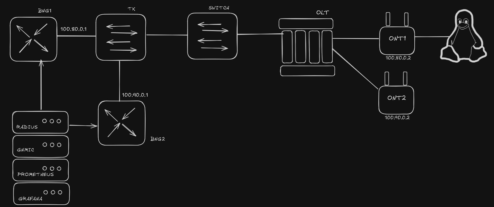
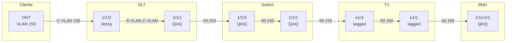

# Underlay Network

## Diagrama de Conectividad Física



## Descripción de la Capa Física

El **Underlay** representa la conectividad física entre todos los dispositivos del laboratorio. Esta capa proporciona el transporte de paquetes sin considerar los servicios lógicos que se ejecutan sobre ella.

## Dispositivos y Conexiones

### Nokia 7750 SR-7 (BNG1 y BNG2)

Los BNG son equipos **Nokia 7750 SR-7** simulados que actúan como gateways de banda ancha. Cada BNG tiene:

| Slot | Tipo | MDA | Función |
|------|------|-----|---------|
| A | CPM | - | Control Plane |
| B | CPM | - | Control Plane (Redundante) |
| 1 | IOM5-e | me6-100gb-qsfp28 | Puertos hacia TX |
| 2 | IOM4-e-b | isa2-bb | ISA para NAT/ESM |

```yaml
# Configuración de BNG en lab.yml
bng1:
  kind: nokia_srsim
  image: localhost/nokia/srsim:25.10.R2
  type: sr-7
  components:
    - slot: A
    - slot: B
    - slot: 1
      type: iom5-e
      env:
        NOKIA_SROS_MDA_1: me6-100gb-qsfp28
        NOKIA_SROS_SFM: m-sfm6-7/12
    - slot: 2
      type: iom4-e-b
      env:
        NOKIA_SROS_MDA_1: isa2-bb
        NOKIA_SROS_SFM: m-sfm6-7/12
```

### Nokia SR Linux (TX)

El switch **TX** es un Nokia SR Linux que actúa como punto de agregación entre los BNGs y la red de acceso:

| Puerto | Conexión | Descripción |
|--------|----------|-------------|
| ethernet-1/1 | BNG1:1/1/c1/1 | Uplink a BNG1 |
| ethernet-1/2 | BNG2:1/1/c1/1 | Uplink a BNG2 |
| ethernet-1/3 | Switch:1/1/1 | Downlink hacia acceso |

### Nokia 7250 IXR-ec (Switch y OLT)

Tanto el **Switch** como el **OLT** utilizan Nokia 7250 IXR-ec simulados:

```yaml
switch:
  kind: nokia_srsim
  type: ixr-ec
  components:
    - slot: A
      type: cpm-ixr-ec
      env:
        NOKIA_SROS_MDA_1: m4-1g-tx+20-1g-sfp+6-10g-sfp+
```

#### Conexiones del Switch

| Puerto | Conexión | Modo | Encapsulación |
|--------|----------|------|---------------|
| 1/1/1 | TX:ethernet-1/3 | Hybrid | QinQ |
| 1/1/3 | OLT:1/1/1 | Hybrid | QinQ |

#### Conexiones del OLT

| Puerto | Conexión | Modo | Encapsulación |
|--------|----------|------|---------------|
| 1/1/1 | Switch:1/1/3 | Hybrid | QinQ |
| 1/1/2 | ONT1:eth1 | Access | 802.1Q |
| 1/1/3 | ONT2:eth1 | Access | 802.1Q |

## Configuración de Puertos

### BNG - Puertos hacia TX

```text
/configure port 1/1/c1/1 admin-state enable
/configure port 1/1/c1/1 connector breakout c1-100g
/configure port 1/1/c1/1 ethernet mode hybrid
/configure port 1/1/c1/1 ethernet encap-type qinq
```

### TX - Interfaces

```text
set /interface ethernet-1/1 admin-state enable
set /interface ethernet-1/1 vlan-tagging true
set /interface ethernet-1/1 tpid TPID_ANY

set /interface ethernet-1/2 admin-state enable
set /interface ethernet-1/2 vlan-tagging true
set /interface ethernet-1/2 tpid TPID_ANY

set /interface ethernet-1/3 admin-state enable
set /interface ethernet-1/3 vlan-tagging true
set /interface ethernet-1/3 tpid TPID_ANY
```

### Switch - Puertos

```text
/configure port 1/1/1 admin-state enable
/configure port 1/1/1 ethernet mode hybrid
/configure port 1/1/1 ethernet encap-type qinq

/configure port 1/1/3 admin-state enable
/configure port 1/1/3 ethernet mode hybrid
/configure port 1/1/3 ethernet encap-type qinq
```

### OLT - Puertos

```text
/configure port 1/1/1 admin-state enable
/configure port 1/1/1 ethernet mode hybrid
/configure port 1/1/1 ethernet encap-type qinq

/configure port 1/1/2 admin-state enable
/configure port 1/1/2 ethernet mode access
/configure port 1/1/2 ethernet encap-type dot1q

/configure port 1/1/3 admin-state enable
/configure port 1/1/3 ethernet mode access
/configure port 1/1/3 ethernet encap-type dot1q
```

## Esquema de Encapsulación



## Tabla de Resumen de Conexiones

| Origen | Puerto | Destino | Puerto | Tipo |
|--------|--------|---------|--------|------|
| BNG1 | 1/1/c1/1 | TX | ethernet-1/1 | 100G |
| BNG2 | 1/1/c1/1 | TX | ethernet-1/2 | 100G |
| TX | ethernet-1/3 | Switch | 1/1/1 | 10G |
| Switch | 1/1/3 | OLT | 1/1/1 | 10G |
| OLT | 1/1/2 | ONT1 | eth1 | 1G |
| OLT | 1/1/3 | ONT2 | eth1 | 1G |
| BNG1 | 1/1/c2/1 | iPerf | eth1 | 100G |
| BNG2 | 1/1/c2/1 | iPerf | eth2 | 100G |
| ONT1 | eth2 | PC1 | eth1 | 1G |
